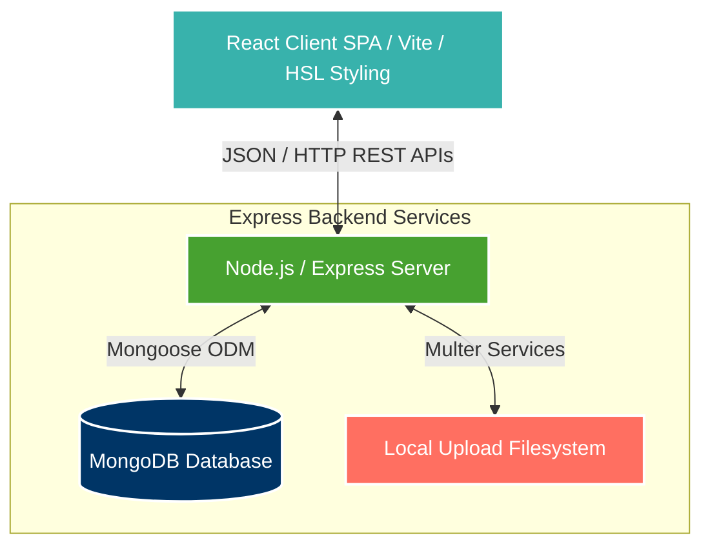

# <p align="center"><br>Aatmanirbhar Nari — Business Enablement Portal</p>

<p align="center">
  <strong>Empowering Women Entrepreneurs through Direct Lead Management, Mentorship & Interactive Marketplaces</strong>
</p>

<p align="center">
  
  
  
  
  
</p>

---

### Table of Contents
1. [Executive Summary & Core Mission](#1-executive-summary--core-mission)
2. [Platform Architecture & System Design](#2-platform-architecture--system-design)
3. [User Personas & Feature Suite](#3-user-personas--feature-suite)
4. [File System Directory Map](#4-file-system-directory-map)
5. [Database Schema & Models](#5-database-schema--models)
6. [API Endpoint Registry](#6-api-endpoint-registry)
7. [Setup & Quick Start Guide](#7-setup--quick-start-guide)
   - [🐳 Docker Container Setup (Recommended)](#docker-container-setup-recommended)
   - [💻 Manual Local Environment Setup](#manual-local-environment-setup)
8. [Troubleshooting Guide](#8-troubleshooting-guide)
9. [Developer Resources & Scripts](#9-developer-resources-from-here)

---

### 1. Executive Summary & Core Mission

**Aatmanirbhar Nari** (translates to *Self-Reliant Woman*) is a custom-built digital enablement portal built to provide women entrepreneurs with the technical and operational tools needed to list their enterprises, attract direct customer leads, and connect with business mentors.

Built with a modern **MERN (MongoDB, Express, React, Node.js) stack**, the portal addresses the lack of structured marketing platforms and mentorship networks for local women-led micro-enterprises. Through a streamlined business registry, structured service inquiries, and active mentorship panels, the portal helps bridge operational gaps and drives positive socio-economic growth.

---

### 2. Platform Architecture & System Design

The application operates as a decoupled MERN architecture backed by standard database layers and automated Docker orchestrations:



* **Frontend:** A React Single Page Application (SPA) utilizing Vite, configuring active local storage authentication tokens, glassmorphism theme components, and instant real-time inquiry checking loops.
* **Backend:** Express API providing route layers, Multer file upload pipelines, token-based security guards, and database schemas.
* **Docker Network:** Bundled services containerizing MongoDB, Mongo Express (web-based visual admin GUI), and backend API structures into a unified local network.

---

### 3. User Personas & Feature Suite

The application centers around three critical user structures:

#### 👩‍💼 1. The Entrepreneur (Women-led Businesses)
* **Interactive Dashboard:** Complete lead overview showing profile strength metrics, incoming customer inquiries, and monthly page views.
* **Business Profile Creator:** Showcase business details, add banners, upload logos, set contact numbers, and link locations.
* **Lead Response Panel:** View customer messages, toggle inquiry status (`new` $\rightarrow$ `contacted` $\rightarrow$ `closed`), and access direct email or phone numbers instantly.
* **Mentor Connect Hub:** Direct communication panel to search for business mentors and schedule growth calls.

#### 👥 2. The Customer / Public User
* **Local Marketplace Directory:** Filter businesses by category, rating, location, or name.
* **Direct Inquiry Form:** Instant contact popup allowing customers to send direct service requests to the entrepreneur.

#### 👑 3. The Platform Admin
* **Verification Hub:** Approve or suspend business listings.
* **Analytics Oversight:** Track user growth, total lead generations, and mentor assignments.

---

### 4. File System Directory Map

```bash
Aatmanirbhar Nari/
├── client/                     # Frontend Application Layer
│   ├── src/
│   │   ├── components/         # Reusable UI Blocks (Glassmorphism layout cards)
│   │   ├── pages/              # Dashboards, Mentor Panels, Profiles
│   │   ├── services/           # Axios wrappers for server endpoints
│   │   └── App.jsx             # React routing entry point
│   ├── index.html              # Core client HTML index
│   ├── vite.config.js          # Vite build and server settings
│   └── package.json
├── server/                     # Backend API Layer
│   ├── middleware/             # Auth guards and token verifications
│   ├── models/                 # Mongoose Schema Definitions
│   │   ├── User.js             # Basic accounts (Entrepreneurs, Admins)
│   │   ├── Business.js         # Enterprise profiles and metadata
│   │   └── Inquiry.js          # Customer lead metrics and forms
│   ├── routes/                 # Express controllers and endpoint targets
│   ├── index.js                # Server booting entry point
│   ├── Dockerfile              # Docker container recipe
│   └── package.json
├── narisakti/                  # Prototype exports and UI drafts
├── start-docker.bat            # One-click Windows startup script
├── start-docker.ps1            # PowerShell orchestration command
└── docker-compose.yml          # Container configuration manifest
```

---

### 5. Database Schema & Models

#### User Schema (`server/models/User.js`)
Handles core registration details, roles (`entrepreneur`, `mentor`, `admin`), and passwords.
```javascript
const userSchema = new mongoose.Schema({
  name: { type: String, required: true },
  email: { type: String, required: true, unique: true },
  password: { type: String, required: true },
  role: { type: String, enum: ['entrepreneur', 'mentor', 'admin'], default: 'entrepreneur' },
  createdAt: { type: Date, default: Date.now }
});
```

#### Business Schema (`server/models/Business.js`)
Tracks the entrepreneur's organization details, logos, social media handles, and approval statuses.
```javascript
const businessSchema = new mongoose.Schema({
  owner: { type: mongoose.Schema.Types.ObjectId, ref: 'User', required: true },
  name: { type: String, required: true },
  category: { type: String, required: true },
  description: { type: String },
  address: { type: String },
  phone: { type: String },
  logo: { type: String },
  rating: { type: Number, default: 0 },
  isApproved: { type: Boolean, default: false },
  createdAt: { type: Date, default: Date.now }
});
```

#### Inquiry Schema (`server/models/Inquiry.js`)
Stores incoming customer service queries and response tracking.
```javascript
const inquirySchema = new mongoose.Schema({
  business: { type: mongoose.Schema.Types.ObjectId, ref: 'Business', required: true },
  customerName: { type: String, required: true },
  customerEmail: { type: String, required: true },
  customerPhone: { type: String },
  message: { type: String, required: true },
  status: { type: String, enum: ['new', 'contacted', 'closed'], default: 'new' },
  createdAt: { type: Date, default: Date.now }
});
```

---

### 6. API Endpoint Registry

| Method | Endpoint | Auth Required | Purpose |
| :--- | :--- | :--- | :--- |
| **POST** | `/api/auth/register` | Public | Register new user account |
| **POST** | `/api/auth/login` | Public | Authenticate credentials and return JWT |
| **GET** | `/api/businesses` | Public | Retrieve list of all approved businesses |
| **POST** | `/api/businesses` | Entrepreneur | Create a new enterprise profile |
| **PUT** | `/api/businesses/:id` | Owner / Admin | Modify enterprise metadata |
| **POST** | `/api/inquiries` | Public | Send direct service request to business |
| **GET** | `/api/inquiries/my-leads` | Private | Retrieve inquiries received by entrepreneur |
| **PUT** | `/api/inquiries/:id/status`| Private | Modify lead lifecycle status |
| **POST** | `/api/mentor/connect` | Private | Send mentorship pairing request |
| **GET** | `/api/admin/pending` | Admin | Fetch listings awaiting verification |

---

### 7. Setup & Quick Start Guide

#### 🐳 Docker Container Setup (Recommended)
Verify [Docker Desktop](https://www.docker.com/products/docker-desktop) is running.

1. **Launch from command line:**
   ```powershell
   # Open PowerShell in the project root directory and run
   .\start-docker.ps1
   ```
   *Alternatively, double click the `start-docker.bat` file in Windows.*

2. **Access local services:**
   * **React Frontend Portal:** [http://localhost:3000](http://localhost:3000)
   * **Express Server API:** [http://localhost:5000](http://localhost:5000)
   * **Mongo Express GUI:** [http://localhost:8081](http://localhost:8081) *(Creds: `admin` / `admin123`)*

---

#### 💻 Manual Local Environment Setup
To run manually without Docker containers:

1. **Prerequisites:** Ensure [MongoDB](https://www.mongodb.com/try/download/community) is installed and active on port `27017`.

2. **Setup Server Layer:**
   ```bash
   cd server
   npm install
   npm run dev
   ```
   *Runs backend API server on [http://localhost:5000](http://localhost:5000)*

3. **Setup Client Layer:**
   ```bash
   cd ../client
   npm install
   npm run dev
   ```
   *Runs frontend dev bundle on [http://localhost:3000](http://localhost:3000)*

---

### 8. Troubleshooting Guide

#### ❌ MongoDB connection refused:
* Ensure local MongoDB service is started: `net start MongoDB` in admin console, or verify the `aatmanirbhar_nari_mongodb` container is running in Docker.

#### ❌ Port 5000 is occupied:
* Close the occupying process:
  ```powershell
  Stop-Process -Id (Get-NetTCPConnection -LocalPort 5000).OwningProcess -Force
  ```

---
<p align="center">Empowering communities through innovative solutions. 🚀</p>
